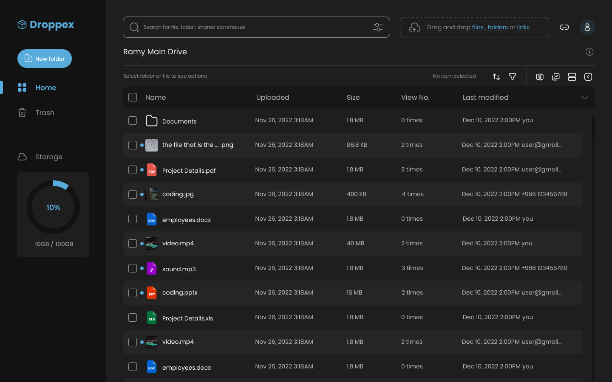

### Overview

The layout depicted above can be dissected into two primary sections:

1. **Sidebar Block**: This section encompasses essential components facilitating navigation and information display.
   
   - **Logo**: Represents the visual identity of the application.
   - **Sidebar Items**: Navigation elements aiding users in accessing various sections of the application.
   - **Storage Usage UI**: Provides insightful data on the utilization of storage resources.

2. **Main Page Block**: This segment constitutes crucial elements for user interaction and data presentation.

   - **Header**: The topmost section serving as a navigational anchor and providing contextual information.
   - **File/Folders Table List**: A structured representation facilitating the management and organization of files and folders.

To gain a clearer understanding of the layout's structure and organizational hierarchy, please refer to the image provided below.

---

> Created using Canva.